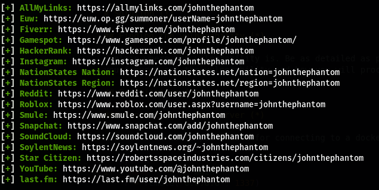
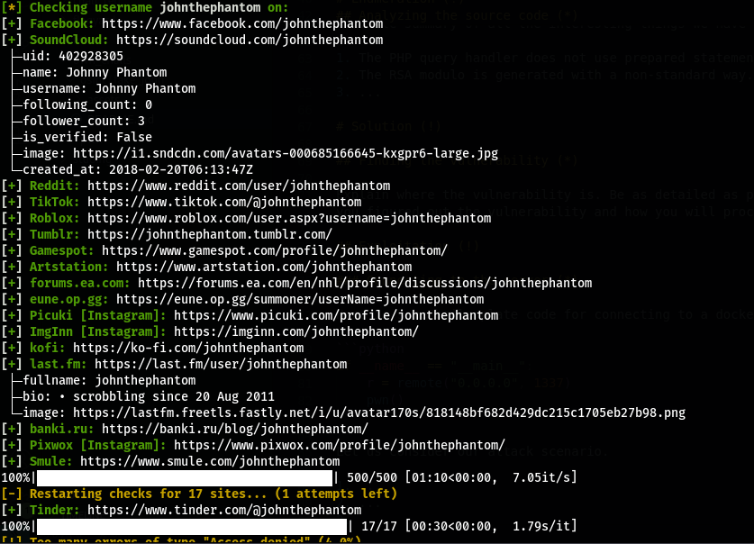
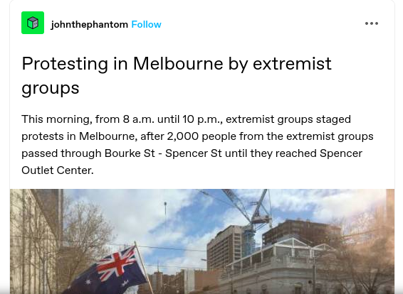
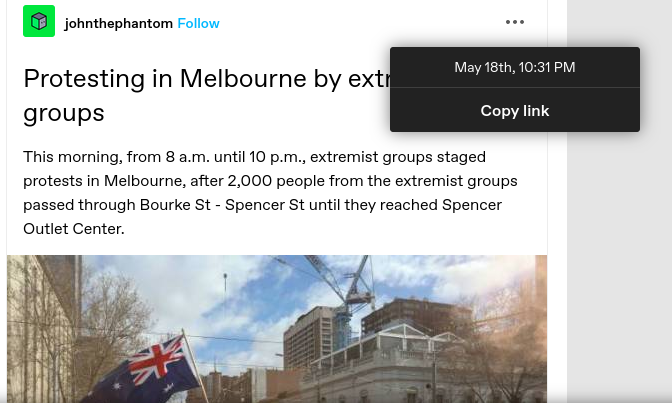
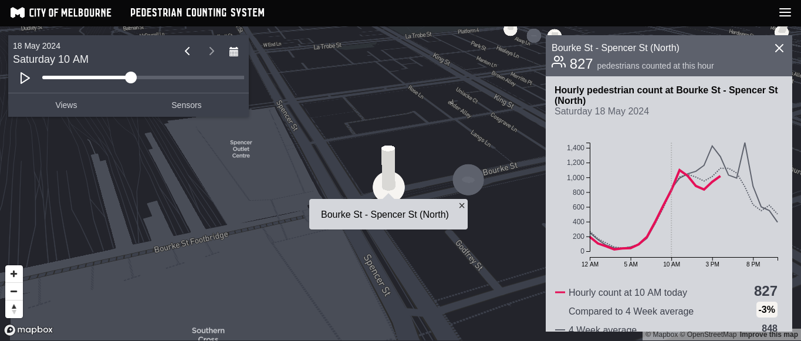

 <Challenge_Name>

19th May 2024

Prepared By: `Tensi`

Challenge Author(s): `Tensi`

Difficulty: Easy

  

***NOTE : The headings with `(!)` should be necessarily included in your writeup while the ones with `(*)` are optional and should be included only if there is a need to. Of course, you can modify the content of each section accordingly. We just provide some boilerplate text.***

# Synopsis (!)

- Find social media accounts.
- Find public pedestrian data.

## Description (!)

- We have been hunting for someone who calls himself John the Phantom for about four months now. This person has been spreading fake news all around the world. We were able to track down his Twitter account, but we believe he still has other social media accounts. His last post on Twitter was about some protests in Melbourne. We want you to find his other social media accounts. Then, from the post about the protests, determine the real number of pedestrians each hour on the day he posted the news.

The flag format is HTB{WEBSITE_NAME-1HOUR_REAL_NUMBER-2HOUR_REAL_NUMBER-3HOUR_REAL_NUMBER}. 

For example, if the website where he has an account is Facebook and the real number of pedestrians each hour is 345, 355, and 934, then the flag will be HTB{facebook-345-355-934}.

## Skills Required (!)

- Basic OSINT

## Skills Learned (!)

- Learn how to find pedestrian numbers in the city that provide it.
- Learn how to find users in social media.

# Solution (!)

## Finding the social media account.

We start by pick some usernames for the guy we are searching for, he call him self John the Phantom so we will start with something like johnphantom and johnthephantom.

Let's start with sherlock.

After checking theis accounts we will not find the wanted account. so lets try maigret.

In the results of maigret we will find tumblr account, after open the account we will find one post about protesting in Melbourne.

So tumblr is our first part of the flag.

## Detect the fake news.

Now we need to proof that this news is fake, we will start with the fact that the protest was in Melbourne, from 8 to 10 so we need to get the number of people who walked through Bourke St - Spencer St in 8 am, 9 am and 10 am.

First let's get the date when this posted.

From here , the Melbourne city has a public pedetrian system, so we can use that to get the number of people who walked through the Bourke St - Spencer street.

Like we see in the image the number of people in 10 am was 827. from here you can get the two other.